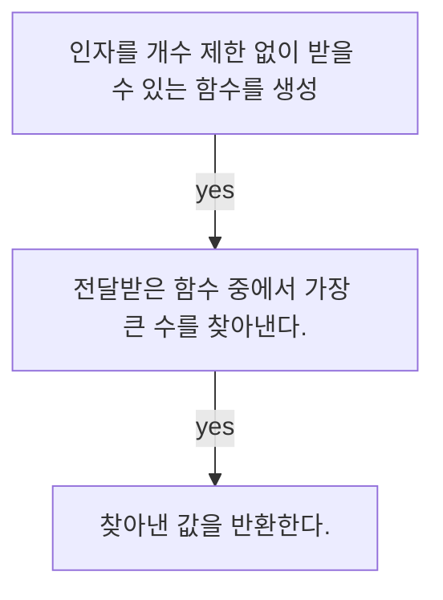

## 주어진 문제

### 개수의 제한 없이 전달받은 인수 중에서 가장 큰 수를 반환하는 함수를 생성하세요
#### 문제 해결 과정
---
#### 1. 함수를 생성하세요.
#### 2. 함수의 인자로 개수의 제한 없이 인수를 전달할 수 있는 문법을 사용
#### 3. 전달 받은 인수 중에서 가장 큰 수를 찾아내고
#### 4. 찾아낸 값을 반환하자!
---



```python
print('==== 문제 풀기 ====')


# 1. 함수를 생성하세요.
def input_func():


# 2. 함수의 인자로 개수의 제한 없이 인수를 전달할 수 있는 문법을 사용
def input_func(*args): # 가변 인수를 사용하여 인수를 전달 받음..!

# 3. 전달 받은 인수 중에서 가장 큰 수를 찾아내고
list_data = []
for num in args: # 자료안에 어떤 요소가 들어있는지 확인하고 싶을 때는 in 연산자를 사용한다.
    list_data.append(num)
list_data.sort()

# 4. 찾아낸 값을 반환하자!
return list_data[-1]
```

```python
# 전체 코드
def input_func(*args):
    list_data = []
    for num in args:
        list_data.append(num)
    list_data.sort()
    return list_data[-1]

print(input_func(10, 230, 40, 30, 20, 5)) # 230

```


