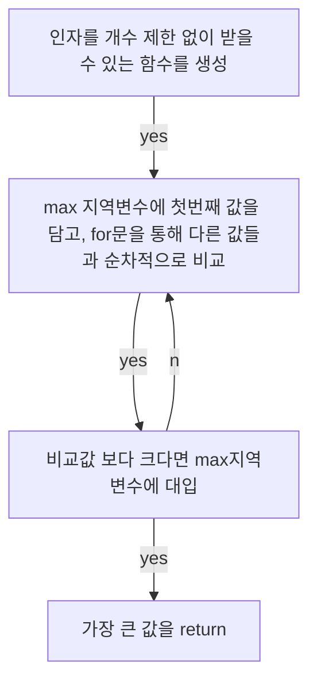

## **Today What I Learend**  
파이썬이라는 프로그래밍 언어를 가지고 크롤링을 위한 세팅부터 시작해서 간단한 세팅, 실제 사이트에서 다양한 데이터를 수집하는 과정을 진행했다.

말로만 그리고 커뮤니티 게시판으로만 전해들었던 크롤링을 실제로 직접해보니 놀랍다. 새삼 잊고 지냈던 프로그래밍 언어의 위력을 다시금 느낄 수 있었다. 

---
**Today I Learend**
- Web Crawling을 시작하기 위한 세팅
- 본격적인 Crawling 시작에 앞서 간단한 맛보기
- Crawling - 네이버 날씨 
- Crawling - 네이버 웹툰
- Crawling - 정부부처 사이트 게시판 읽어오기

---

