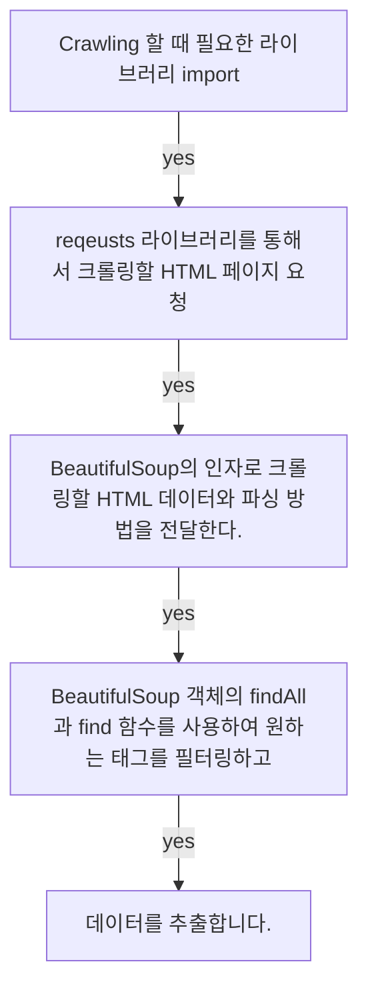

## **Today What I Learend**  

크롤링을 위한 세팅부터 시작해서 파이썬이라는 프로그래밍 언어로 실제 사이트에서 제공하는 날씨, 웹툰, 게시글 등 다양한 데이터를 수집하는 과정을 학습했다.

말로만 그리고 커뮤니티 게시판으로만 전해들었던 크롤링을 실제로 직접해보니 놀랍다. 새삼 잊고 지냈던 프로그래밍 언어의 위력을 다시금 느낄 수 있었다. 


---
**Today I Learend**
- Web Crawling을 시작하기 위한 세팅
- 본격적인 Crawling 시작에 앞서 간단한 맛보기
- Crawling - 네이버 날씨 
- Crawling - 네이버 웹툰
- Crawling - 정부부처 사이트 게시판 읽어오기

---


### Web Crawling을 시작하기 위한 세팅


- requests 라이브러리 설치
- BeautifulSoup4 설치

requests는 웹사이트에 접속하여 HTML을 가져오는 라이브러리이다. 
BeautifulSoup은 HTML과 XML로부터 데이터를 가져오기 위한 파이썬 라이브러리이며, 구문 분석, 트리 탐색, 검색, 수정 등의 작업을 할 수 있다.

requests와 BeautifulSoup는 웹 페이지 분석에 필수적인 라이브러리이다.

```python
import requests

request_status = requests.get('https://www.naver.com/')
print(request_status.status_code) # 200
print(request_status.text) # naver의 html

```

### 본격적인 Crawling 시작에 앞서 간단한 맛보기

#### Crawling이 진행되는 과정




```python
import bs4

html = """
<!DOCTYPE html>
<html lang="en">
<head>
    <meta charset="UTF-8">
    <title>Example Crwaling</title>
</head>
<body>
    <h1 class="haeder--tit">1.웹 크롤링을 위한 실습 태그입니다.</h1>
    <h1 class="header__random">2.임의로 만든 실습 태그입니다. 중복 사용된 태그는 다른 메소드를 찾아야 합니다.</h1>
</body>
</html>"""

# BeautifulSoup 객체를 변수에 할당
bs_object = bs4.BeautifulSoup(html, 'html.parser')
# BeautifulSoup 객체를 통해 찾은 태그를 변수에 할당
h1_tag = bs_object.findAll('h1')

# 중복된 태그이므로 for문으로 각 요소들을 순회하면서 태그에 담긴 데이터를 출력
for tag in h1_tag:
    print(tag.text)

# 1.웹 크롤링을 위한 실습 태그입니다.
# 2.임의로 만든 실습 태그입니다. 중복 사용된 태그는 다른 메소드를 찾아야 합니다.

```


### Crawling - 네이버 날씨 


```python


```


```python


```
