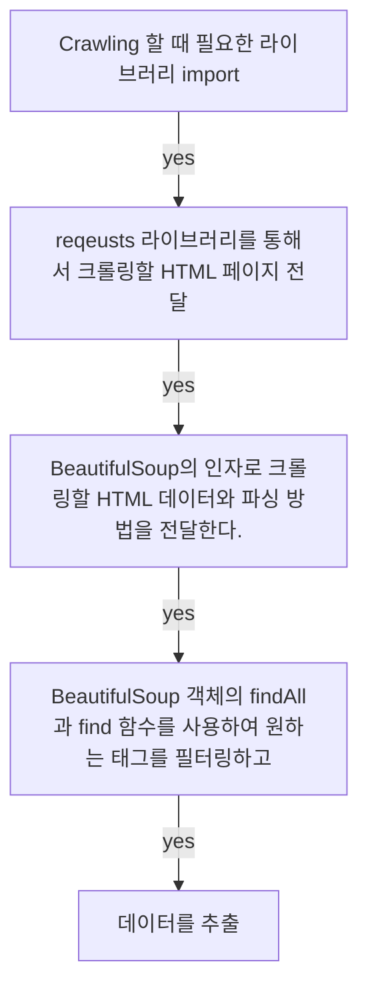
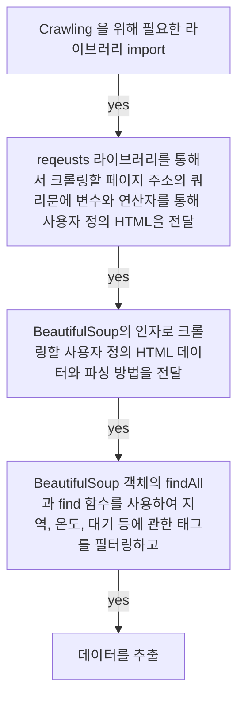
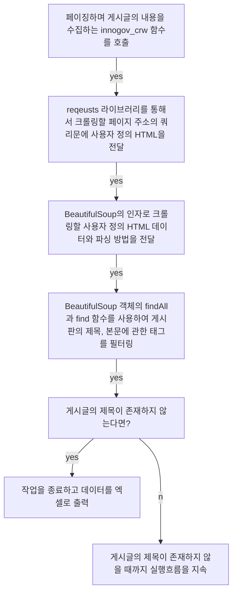

## **Today What I Learend**  

크롤링을 위한 세팅부터 시작해서 파이썬이라는 프로그래밍 언어로 실제 사이트에서 제공하는 날씨, 웹툰, 게시글 등 다양한 데이터를 수집하는 과정을 학습했다.

말로만 그리고 커뮤니티 게시판으로만 전해들었던 크롤링을 실제로 직접해보니 놀랍다. 새삼 잊고 지냈던 프로그래밍 언어의 위력을 다시금 느낄 수 있었다. 


---
**Today I Learend**
- Web Crawling을 시작하기 위한 세팅
- 본격적인 Crawling 시작에 앞서 간단한 맛보기
- Crawling - 네이버 날씨 
- Crawling - 네이버 웹툰
- Crawling - 정부부처 사이트 게시판 읽어오기

---


### Web Crawling을 시작하기 위한 세팅


- requests 라이브러리 설치
- BeautifulSoup4 설치

requests는 웹사이트에 접속하여 HTML을 가져오는 라이브러리이다. 
BeautifulSoup은 HTML과 XML로부터 데이터를 가져오기 위한 파이썬 라이브러리이며, 구문 분석, 트리 탐색, 검색, 수정 등의 작업을 할 수 있다.

requests와 BeautifulSoup는 웹 페이지 분석에 필수적인 라이브러리이다.

```python
import requests

request_status = requests.get('https://www.naver.com/')
print(request_status.status_code) # 200
print(request_status.text) # naver의 html

```

### 본격적인 Crawling 시작에 앞서 간단한 맛보기

#### Crawling이 진행되는 과정




```python
import bs4

html = """
<!DOCTYPE html>
<html lang="en">
<head>
    <meta charset="UTF-8">
    <title>Example Crwaling</title>
</head>
<body>
    <h1 class="haeder--tit">1.웹 크롤링을 위한 실습 태그입니다.</h1>
    <h1 class="header__random">2.임의로 만든 실습 태그입니다. 중복 사용된 태그는 다른 메소드를 찾아야 합니다.</h1>
</body>
</html>"""

# BeautifulSoup 객체를 변수에 할당
bs_object = bs4.BeautifulSoup(html, 'html.parser')
# BeautifulSoup 객체의 findAll메서드를 통해 찾은 태그를 변수에 할당
h1_tag = bs_object.findAll('h1')

# 중복된 태그이므로 for문으로 각 요소들을 순회하면서 태그에 담긴 데이터를 출력
for tag in h1_tag:
    print(tag.text)

# 1.웹 크롤링을 위한 실습 태그입니다.
# 2.임의로 만든 실습 태그입니다. 중복 사용된 태그는 다른 메소드를 찾아야 합니다.

```


### Crawling - 네이버 날씨 




```python
# Crawling 을 위해 필요한 라이브러리 import
import requests
import bs4

def crwal_data():
	# input 을 통해 사용자에게 지역이름 요청
    user_addr = input('날씨를 알아보고 싶은 지역을 입력하세요')
	
	# reqeusts 라이브러리를 통해 크롤링할 페이지 주소의 쿼리문에 변수와 연산자를 통해 사용자 정의 HTML을 요청
    html = requests.get('https://search.naver.com/search.naver?query='+ user_addr +'날씨')
	
	# HTTP 요청이 성공적으로 응답했을 때
    if html.status_code == 200:
		# BeautifulSoup의 인자로 크롤링할 사용자 정의 HTML 데이터와 파싱 방법을 전달
        bs_object = bs4.BeautifulSoup(html.text, 'html.parser')

        # BeautifulSoup 객체의 메서드 find 를 이용해 지역 데이터 추출 
		address = bs_object.find('span', {'class': 'btn_select'})
        temp = bs_object.find('span', {'class': 'todaytemp'})
        print('온도: ', user_addr, temp.text)
		
		# BeautifulSoup 객체의 메서드 find 를 이용해 대기정보 데이터 추출 
		indicator_tag = bs_object.find('dl', {'class': 'indicator'})
        dd_tags = indicator_tag.findAll('span', {'class': 'num'})
        text_dd = ['미세먼지', '초미세먼지', '오존지수']
        for text, tag in zip(text_dd, dd_tags):
            # zip 함수를 통해서 두 개의 리스트를 병렬로 표현
			print(text, tag.text)
    else:
        print('오류입니다..')
		
crwal_data()

# 날씨를 알아보고 싶은 지역을 입력하세요 | 금천구
# 온도:  서울특별시 금천구 가산동 8
# 미세먼지 59㎍/㎥
# 초미세먼지 43㎍/㎥
# 오존지수 0.008ppm
```


### Crawling - 정부부처 사이트 게시판 읽어오기





```python
# Crawling과 excel로 데이터 출력을 위해 필요한 라이브러리 import
import requests
import bs4
import pandas

# 게시글의 제목과 내용을 담아올 리스트 변수 선언
title_list = []
detail_list = []

def detail(url):
	# reqeusts 라이브러리를 통해 크롤링할 페이지 주소의 쿼리문에
	# 변수와 연산자를 통해 사용자 정의 HTML을 요청
    html = requests.get("https://www.innogov.go.kr/" + url)
	
	# BeautifulSoup의 인자로 크롤링할 사용자 정의 HTML 데이터와 파싱 방법을 전달		 	
    bs_object = bs4.BeautifulSoup(html.text, "html.parser")
	
	# BeautifulSoup 객체의 함수 find 를 이용해 게시글 본문 데이터 추출
    print(bs_object.find("div", {"class": "dbData"}).text)
	# 추출한 데이터를 게시글 본문 내용을 담는 리스트에 추가
    detail_list.append(bs_object.find("div", {"class": "dbData"}).text)

def page(index):
	# reqeusts객체의 get 메서드의 인자에 변수와 연산자를 통해 사용자 정의 HTML을 요청
    html = requests.get("https://www.innogov.go.kr/ucms/bbs/B0000042/list.do?sort=02&searchCnd=1&searchWrd=&pageIndex=" + str(index) + "&menuNo=300125")
    
	# BeautifulSoup의 인자로 크롤링할 사용자 정의 HTML 데이터와 파싱 방법을 전달		 		
	bs_object = bs4.BeautifulSoup(html.text, "html.parser")

	# BeautifulSoup 객체의 메서드 findAll을 이용해 모든 td태그의 내용을 변수에 할당
	title_tags = bs_object.findAll('td', {"class": "tit"})
    if len(title_tags): # 데이터의 인덱스가 0이 아니라면 실행
        for title in title_tags:
            print(title.text) # td 각 요소를 순회하면서 text 속성값을 출력
            try:
				# 디테일 함수를 호출하여 게시판 본문을 콘솔에 출력하고, detail_list 에 추가
                detail(title.find('a')["href"])
                title_list.append(title.text) # title_list애 게시글 추가
            except:
				# 오류가 발생한다면 보고하고 실행흐름 유지
                print("오류 : ", title.text)
        return False 
    else:
        return True # 데이터의 인덱스가 0이라면 True 값을 반환하고 함수 종료


def innogov_crw():
    page_num = 1
    while True:
		# page 함수가 호출될 때 BeautifulSoup 객체의 메서드가 읽어올 데이터가 없다면!
		# if 문의 조건을 충족하여 break 를 통해 while문 종료, 더불어 함수 실행 흐름 종료
        if page(page_num):
            break
		# BeautifulSoup 객체의 메서드가 읽어올 데이터가 남아 있다면 다음 페이지 계속 탐색
        page_num += 1

# 게시글이 존재하지 않을 때까지 크롤링을 수행하는 함수를 호출
innogov_crw()

# page(1)

# 딕셔너리 타입의 변수를 선언하고, key와 value로 데이터를 정렬
data = {
    "제목": title_list,
    "내용": detail_list
}

# pandas 라이브러리를 통해 추출한 데이터를 행과 열로 이루어진 DataFrame 자료구조로 변환
# 엑셀의 확장자로 수집 및 가공한 데이터 출력
df = pandas.DataFrame(data)
df.to_excel("innogov.xlsx")


```
