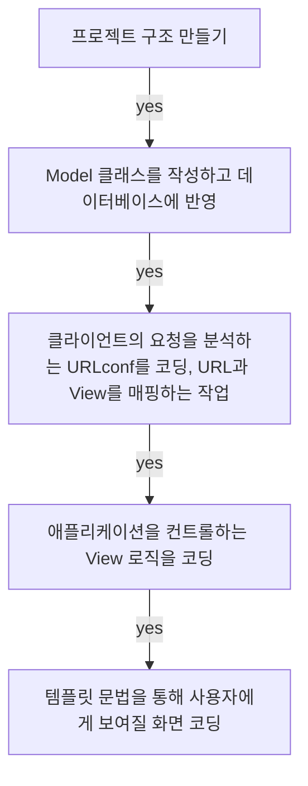
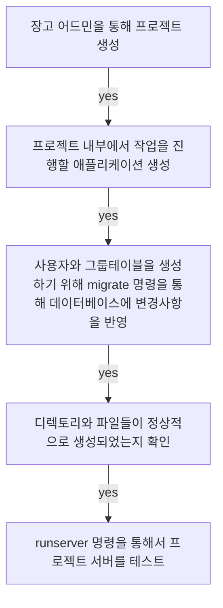

## **Today What I Learend**  

장고를 사용해 간단한 설문조사 애플리케이션을 만들었다. 아직은 부족한 부분이 많지만 이러한 작은 단위의 애플리케이션이 모여서 큰 프로그램으로 발전한다고 생각하니 작은 단위의 학습 및 코드도 잘하고 싶은 욕심이 생긴다. 
오늘 만들어보는 애플리케이션을 숙련하며 이해도를 높이자!

아직 Rest api를 활용해본 경험이 없는 까닭에 Rest api의 역할이나 위력에 대해서 체감이 잘 안간다! 하지만 Rest api가 아래와 같은 이점을 지니고 있다고 하니! 나도 언젠가는 Rest api를 잘 활용할 수 있기를..!

[장고 공식 도큐먼트 - 01을 참고](https://docs.djangoproject.com/ko/3.0/intro/tutorial01/)   
[장고 공식 도큐먼트 - 02을 참고](https://docs.djangoproject.com/ko/3.0/intro/tutorial02/)


---
**Today I Learend**
- 프로젝트 진행 순서, MVT 코딩 순서
- 파일 구조 설정, 에러를 피하기 위해 중요해!
- 스파게티처럼 엉킨 코드가 아닌 MVT 패턴!
- rest api 에 대한 간단한 이해, 써보긴 써봤지만 이게 뭔지 모르겠어! ㅠㅠ..
- 


---

### 프로젝트 진행 순서, MVT 코딩 순서

모델, 뷰, 템플릿 중에서 코딩우선 순위는 스스로가 편한 방식을 따른다. 다만 화면과 로직은 연결되고, 데이터베이스 테이블 설계는 독립적이므로 Model(모델)을 먼저 코딩하고, 그 다음 서로 연결되어 있는 뷰와 템플릿 중에서는 뷰를 먼저 코딩하는 것이 아직까지는 개인적으로 더 나은 방법인 것 같아서 뷰를 먼저 코딩하겠다!




### 1. 파일 구조 설정, 에러를 피하기 위해 중요해!

파일구조는 에러를 피하기 위해서 중요한 것 같다. 파일 구조의 깊이가 깊어지면(폴더 안의 폴더) 예상하지 못한 오류를 일으킬 수 있다. 파일 구조는 프로젝트의 기획 및 뼈대를 만들면서 이해할 수 있다!

```

├── config
│   ├── __init__.py
│   ├── settings.py
│   ├── urls.py
│   ├── wsgi.py
├── polls
├── db.sqlite3
└── manage.py
```


#### 위와 같은 프로젝트 구조를 만들기 위한 설정
config 에는 프로젝트를 위한 설정 파일과 웹 서비스 실행을 위한 파일이 들어있다. 기본적인 문서구조가 잘못되면 에러를 만나게 되므로! 프로젝트 개발에 필요한 애플리케이션 디렉토리와 파일을 생성할 때 주의하자!



**나의 코드에서 오류가 발생했는지, 장고에서 오류가 발생했는지는 프로젝트가 한참 지난 후에는 찾기 어려우므로 애플리케이션을 생성한 이후에는 항상 서버를 실행하는 과정을 거치자.**


### 2. 스파게티처럼 엉킨 코드가 아닌 MVT 패턴!

### 3. MVT 패턴을 위한 첫 번째 Model 코딩!


#### 2-1. Model 코딩  
애플리케이션 생성을 통해 만든 votes의 디렉토리의 `models.py` 파일에 아래와 같은 내용을 코딩한다.   
[데이터베이스의 각 필드는 Field 클래스의 인스턴스로서 표현된다.](https://docs.djangoproject.com/ko/3.0/intro/tutorial02/#creating-models) CharField 는 문자(character) 필드를 표현하고, DateTimeField 는 날짜와 시간(datetime) 필드를 표현한다. 이것은 각 필드가 어떤 자료형을 가질 수 있는지를 Django 에게 말해준다.


```python

from django.db import models

# Create your models here.

class Question(models.Model):
    question_text = models.CharField(max_length=100)
    pub_date = models.DateTimeField('date published')

    def __str__(self):
        return self.question_text

class Choice(models.Model):
    question = models.ForeignKey(Question, on_delete=models.CASCADE)
    choice_text = models.CharField(max_length=100)
    votes = models.IntegerField(default=0)

    def __str__(self):
        return self.choice_text

```

**Django 는 N:1(many-to-one), N:N(many-to-many), 1:1(one-to-one) 과 같은 모든 일반 데이터베이스의 관계들를 지원**


#### 2-2. Model Activate!!(활성화)

`models.py`에서 작성한 코드는 Django에게는 상당한 정보를 전달하며, Django는 이 정보를 가지고 다음과 같은 일을 수행한다.

- 애플리케이션을 위한 스키마 생성, `CREATE TABLE`
- `Question`과 `Choice`객체에 접근하기 위한 Python 데이터베이스 접근 API 생성

그렇지만 위와 같은 작업을 수행하기 위해서는 현재 프로젝트에게 polls 앱이 설치되어 있다는 것을 알려야 한다. 이를 위해 앱의 구성 클래스에 대한 참조를 INSTALLED_APPS 설정에 추가해야 한다.

`mysite/settings.py` 파일 내용을 수정

```python

INSTALLED_APPS = [
    'django.contrib.admin',
    'django.contrib.auth',
    'django.contrib.contenttypes',
    'django.contrib.sessions',
    'django.contrib.messages',
    'django.contrib.staticfiles',
    'polls.apps.PollsConfig', # <= 앱의 구성 클래스에 대한 참조를 INSTALLED_APPS에 설정
]

```

#### 2-3. Model Apply!!(적용)

터미널에서 `python manage.py makemigrations polls` 명령을 실행하면 아래와 같이 Question, Choice 클래스가 테이블 정의를 변경한 상태가 됩니다. 

```
Migrations for 'polls':
  polls/migrations/0001_initial.py:
    - Create model Choice
    - Create model Question
    - Add field question to choice

```

그리고 터미널에 `python manage.py migrate` 명령으로 데이터베이스에 클래스로 정의한 모델을 생성합니다.


#### migrate 명령

`migrate` 명령은 아직 적용되지 않은 migrations을 모두 수집해 실행하며(Django는 django_migrations 테이블을 두어 마이그레이션 적용 여부를 추적한다), 이 과정을 통해 `models.py`에서 작성한 모델의 변경 사항과 데이터베이스의 스키마의 동기화가 이루어진다.

**모델을 만드는 세 가지 지침!!**
1. (models.py 에서) 모델을 변경.
1. python manage.py makemigrations을 통해 변경한 모델 사항에 대한 마이그레이션을 만들고
1. python manage.py migrate 명령을 통해 변경사항을 데이터베이스에 적용.


#### 관리자 생성, admin에서 polls App 변경가능하도록 설정


**[잠깐 장고의 admin 사이트가 자동화가 되어 있는 이유! - 링크](https://docs.djangoproject.com/ko/3.0/intro/tutorial02/#introducing-the-django-admin)**
> Django는 Lawrence Journal-World 신문사의 프로그래머가 처음 개발하였고, 이 때문에, "컨텐츠 게시자" 와 "공개" 사이트의 구분이 명확하다. 사이트 관리자는 뉴스 기사, 사건, 스포츠 경기 결과 같은 것들을 시스템에 추가하고, 그렇게 추가된 컨텐츠는 "공개" 사이트에 노출된다. Django는 사이트 관리자가 컨텐츠를 편집할 수 있는 통합적인 인터페이스를 생성하는 문제를 해결한다.

1. 터미널에 `python manage.py createsuperuser` 을 통해 명령을 실행
1. admin에게 Question object가 admin interface를 가지고 있다는 것을 알려야하는데, 이를 위해 `polls/admin.py` 파일을 열고 register() 메서드의 인자에 Question object를 등록해주어야 한다.

```python

from django.contrib import admin
from .models import Question

# admin site에서 관리 인덱스 페이지 보여주기
admin.site.register(Question) 


```


### 3. MVT 패턴을 위한 두 번째, View 코딩!

장고는 Elegant URL 방식을 사용하여, 직관적이며 뷰와 1:1 로 매핑하므로 개발이 편하고 이해도 쉽습니다. 
> URL pattern is the general form of a URL - for example: /newsarchive/year/month/

Django는 URL로부터 뷰를 얻기 위해 'URLconf'라는 것을 사용합니다. 클라이언트에게 요청을 받으면 URLconf는 URL 패턴을 `urls.py`에 정의된 URL 패턴과 매칭되는지 분석한 후 뷰에 연결합니다.

#### 3-1. URL과 뷰를 매핑하는 URLconf 코딩

```python

from django.urls import path
from . import views

urlpatterns = [
    path('', views.index, name='index'),
    path('<int:question_id>/', views.detail, name='detail'),
    # detail(request, question_id=1), <>를 통해서 int이면 추출하고, 추출한 값을 question_id에 할당한다.
    path('<int:question_id>/results', views.results, name='results'),
    path('<int:question_id>/vote', views.vote, name='vote'),

]


```

#### 3-2. View 코딩

**index 페이지, 투표 상세화면 View 코딩**

##### render shortcut(단축함수)

**render()** 는 첫번째 인자로 request 객체, 두 번째 인자로 템플릿 코드를 로딩한 후에 context 변수를 적용하여, 그 결과를 HTTPResponse 객체에 담아 반환한다.

##### get_object_or_404 shortcut(단축함수)

**get_object_or_404()** 함수는 모델 클래스를 첫 번째 인자로 받고, 두 번째 인자부터 검색 조건으로 몇개의 키워드 인수를 모델 관리자의 get() 함수에 넘깁니다. 만약 객체가 존재하지 않을 경우, Http404 예외가 발생합니다.

```python
def index(request):
    latest_question_list = Question.objects.all().order_by('-pub_date')[:5]
    context = {'latest_question_list': latest_question_list}

    return render(request, 'polls/index.html', context)

def detail(request, question_id):
    question = get_object_or_404(Question, pk=question_id)
    context = {'question': question}
    return render(request, 'polls/detail.html', context)


```

**vote 페이지, 투표 상세화면 View 코딩**


```python

def vote(request, question_id):
    question = get_object_or_404(Question, pk=question_id)
    try:
        selected_choice = question.choice_set.get(pk=request.POST['choice'])
    except (KeyError, Choice.DoesNotExist):
        return render(request, 'polls/detail.html', {
            'question': question,
            'error_message': "투표를 진행해주세요..."
        })
    else:
        selected_choice.votes += 1
        selected_choice.save()
        return HttpResponseRedirect(reverse('polls:results', args=(question_id,)))


def results(request, question_id):
    question = get_object_or_404(Question, pk=question_id)
    context = {'question': question}
    return render(request, 'polls/results.html', context)
		
		
```

### 4. MVT 패턴을 위한 세 번째, Template 코딩


```
mysite
├── config
├── polls
│   ├── migrations
│   └── templates
│        └── polls
│	          ├── index.html
│	          ├── detail.html
│	          └── results.html
│
├── manage.py
└── db.sqlite3

```

#### index Template


#### detail Template


#### results Template


### Rest api를 쓰는 이유 

- 사용자의 정보를 보여줘야 할 때
- 상세화면에서 더 많은 내용이 필요할 때 레스트 api를 개별로 받아올 수 있다. 
- Rest api를 쓰면 UI까지 만들어진다. 
- 서버 개발자가 개발한 다음에 넘겨받는 사림이 가져다가 쓸 수 없는 경우! 


Rest api 가 없는 경우에는 postman 같은 툴을 사용해서
로그인 했을 떄 헤더에는 어떠한 값, 바디에는 어떠한 값, 또한 어떤 상황애서는 어떠한 값을 호출해야 하는지 패턴을.. 정해야 하는 번거로움이 있는데...! Rest api는 등장과 함께 이러한 문제를 해결하였다.

POSTMAN 이라는 툴을 사용하기 이전에는 문서를 사용해서 정리해야 하는 경우도 있었는데, 이 때는 시간과 에너지가 많이 소모되었다...!
이러한 까닭에 Rest api의 등장이 많은 개발자들에게 각광을 받게 된 것은 아닐까 생각해보게 된다!


