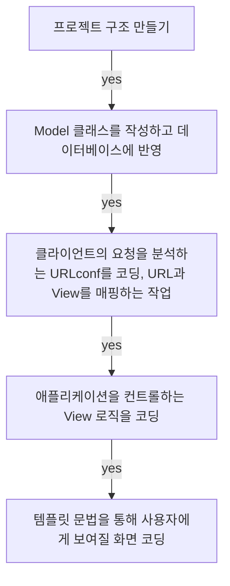
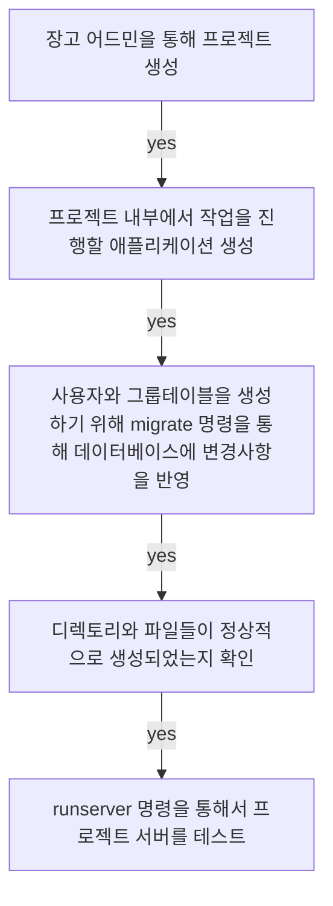

## **Today What I Learend**  

장고를 사용해 간단한 설문조사 애플리케이션을 만들었다. 아직은 부족한 부분이 많지만 이러한 작은 단위의 애플리케이션이 모여서 큰 프로그램으로 발전한다고 생각하니 작은 단위의 학습 및 코드도 잘하고 싶은 욕심이 생긴다. 
오늘 만들어보는 애플리케이션을 숙련하며 이해도를 높이자!

[장고 공식 도큐먼트 - 01을 참고](https://docs.djangoproject.com/ko/3.0/intro/tutorial01/)  
[장고 공식 도큐먼트 - 02을 참고](https://docs.djangoproject.com/ko/3.0/intro/tutorial02/)


---
**Today I Learend**
- 프로젝트 진행 순서, MVT 코딩 순서
- 파일 구조 설정, 에러를 피하기 위해 중요해!
- 스파게티처럼 엉킨 코드가 아닌 MVT 패턴!
- rest api 에 대한 간단한 이해, 써보긴 써봤지만 이게 뭔지 모르겠어! ㅠㅠ..
- 


---

### 프로젝트 진행 순서, MVT 코딩 순서

모델, 뷰, 템플릿 중에서 코딩우선 순위는 스스로가 편한 방식을 따른다. 다만 화면과 로직은 연결되고, 데이터베이스 테이블 설계는 독립적이므로 Model(모델)을 먼저 코딩하고, 그 다음 서로 연결되어 있는 뷰와 템플릿 중에서는 뷰를 먼저 코딩하는 것이 아직까지는 개인적으로 더 나은 방법인 것 같아서 뷰를 먼저 코딩하겠다!




### 1. 파일 구조 설정, 에러를 피하기 위해 중요해!

파일구조는 에러를 피하기 위해서 중요한 것 같다. 파일 구조의 깊이가 깊어지면(폴더 안의 폴더) 예상하지 못한 오류를 일으킬 수 있다. 파일 구조는 프로젝트의 기획 및 뼈대를 만들면서 이해할 수 있다!

```

├── config
│   ├── __init__.py
│   ├── settings.py
│   ├── urls.py
│   ├── wsgi.py
├── polls
├── db.sqlite3
└── manage.py
```


#### 위와 같은 프로젝트 구조를 만들기 위한 설정
config 에는 프로젝트를 위한 설정 파일과 웹 서비스 실행을 위한 파일이 들어있다. 기본적인 문서구조가 잘못되면 에러를 만나게 되므로! 프로젝트 개발에 필요한 애플리케이션 디렉토리와 파일을 생성할 때 주의하자!



**나의 코드에서 오류가 발생했는지, 장고에서 오류가 발생했는지는 프로젝트가 한참 지난 후에는 찾기 어려우므로 애플리케이션을 생성한 이후에는 항상 서버를 실행하는 과정을 거치자.**


### 2. 스파게티처럼 엉킨 코드가 아닌 MVT 패턴!

### 3. MVT 패턴을 위한 첫번째 Model 코딩!


#### 2-1. Model 코딩  
애플리케이션 생성을 통해 만든 votes의 디렉토리의 `models.py` 파일에 아래와 같은 내용을 코딩한다.   
[데이터베이스의 각 필드는 Field 클래스의 인스턴스로서 표현된다.](https://docs.djangoproject.com/ko/3.0/intro/tutorial02/#creating-models) CharField 는 문자(character) 필드를 표현하고, DateTimeField 는 날짜와 시간(datetime) 필드를 표현한다. 이것은 각 필드가 어떤 자료형을 가질 수 있는지를 Django 에게 말해준다.


```python

from django.db import models

# Create your models here.

class Question(models.Model):
    question_text = models.CharField(max_length=100)
    pub_date = models.DateTimeField('date published')

    def __str__(self):
        return self.question_text

class Choice(models.Model):
    question = models.ForeignKey(Question, on_delete=models.CASCADE)
    choice_text = models.CharField(max_length=100)
    votes = models.IntegerField(default=0)

    def __str__(self):
        return self.choice_text

```

**Django 는 N:1(many-to-one), N:N(many-to-many), 1:1(one-to-one) 과 같은 모든 일반 데이터베이스의 관계들를 지원**


#### 2-2. Model Activate!!(활성화)

`models.py`에서 작성한 코드는 Django에게는 상당한 정보를 전달하며, Django는 이 정보를 가지고 다음과 같은 일을 수행한다.

- 애플리케이션을 위한 스키마 생성, `CREATE TABLE`
- `Question`과 `Choice`객체에 접근하기 위한 Python 데이터베이스 접근 API 생성

그렇지만 위와 같은 작업을 수행하기 위해서는 현재 프로젝트에게 polls 앱이 설치되어 있다는 것을 알려야 한다. 이를 위해 앱의 구성 클래스에 대한 참조를 INSTALLED_APPS 설정에 추가해야 한다.

`mysite/settings.py` 파일 내용을 수정

```python

INSTALLED_APPS = [
    'django.contrib.admin',
    'django.contrib.auth',
    'django.contrib.contenttypes',
    'django.contrib.sessions',
    'django.contrib.messages',
    'django.contrib.staticfiles',
    'polls.apps.PollsConfig', # <= 앱의 구성 클래스에 대한 참조를 INSTALLED_APPS에 설정
]

```


```python


```


```python


```


```

사용자의 정보를 보여줘야 할 때
상세화면에서 더 많은 내용이 필요할 때 레스트 api를 개별로 받아올 수 있다. 

레스트를 쓰면 UI까지 만들어진다. 
서버 개발자가 개발한 다음에 가져다가 쓰셈이 안 될경우..! 


```

- rest api를 쓰는 이유 

rest api 가 없는 경우에는 postman 같은 툴?
로그인 했을 떄 헤더에는 어떠한 값, 바디에는 어떠한 값, ㅇ
어떤 상황애서는 어떠한 값을 호출해야 하는지 패턴을.. 정해야 하는 번거로움이 있지만...! 


POST MAN 이전에는 문서를 사용해야 했...
시간과 에너지가 많이 드는 일이다...


apI 정의할 때 문서로 만들면...
시간과 비용이 많이듦....


```
# 모델 생성
모델을 먼저 생성
데이터 베이스에 넣어보기 위해서
어드민에서 모델을 확인해보도록 하겠다. 

- 모델에서 클래스 생성을 디비를 만들고
- 세팅 INSTALLED_APPS에 넣는다. 넣기전까지는 연동이 되지 않으므로, 오류가 생긴다면 새로 만들어도 상관 없다. 
- makemigrations => 앱의 모델 변경 사항을 정리
- migrate 디비에 모델의 변경사항을 적용

```


3. 어드민 파일에 등록을 해야 한다. 
-	임포트를 하고 
- 모델에서 작성한 내용을 어드민으로 불러와야 한다. 

1. 세팅가서 북마크를 추가한다. 
디비에 쓸 준비를 한다.
마이그레이션 이후 마이그레이트 

1. 디비에 데이터를 써보는 작업을 한다. 
관리자 이름을 맵핑한다. 


1. 뷰를 만들고 임포트를한다.
from django.views.generic import ListView
from .models import Bookmark

- 북마크에서 URL 만든다.
- 뷰에서 패스랑 뷰를 임포트한다. 


1. config를 가서 
url을 받아오면 bookmark에서 처리할 수 있도록 처리한다.

1. 이름은 object_list가 디폴트이다. 
2. 바꾸어주려면 context_object_name를 해야 한다. 


포스트를 하면 토큰을 붙여줘야 한다


크리에이트를 상속받았기 때문에 
따로 기능을 만들어주지 않아도
제네릭뷰를 사용하면 다 만들어준다...

어떤 값을 가져올지 알아야 한다.
수정할 때는 그래서 피케이 값을 가져와야 한다!!


피케이는 데이터가 하나기 대문에 오브젝트이다. 굉장히 직관적인 측면이 있다. 


---


```

class BookmarkDetailView(DetailView):
    model = Bookmark

# Bookmark 가 소문자로 바뀌고 뒤에는 디폴트 값으로 계속해서 파일 구조의 경로가 붙는다.


```


