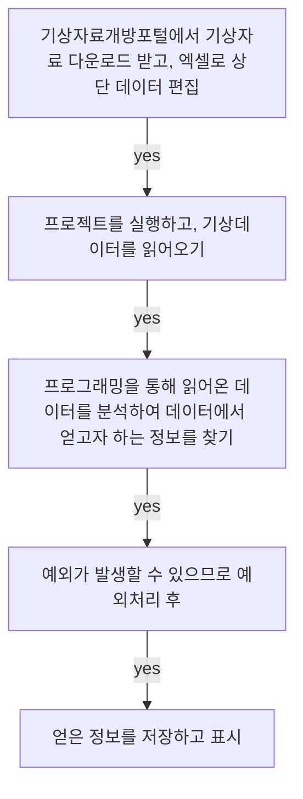

## **Today What I Learend**  

python으로 matplotlibt으로 기상자료개발 포털사이트에서 기후통계 자료를 파이썬으로 제어해보고 분석하는 학습을 진행했다.
서울의 기상 데이터를 통해서
주어진 자료에서 최고 기온을 찾고, 최저 기온을 찾고 
주어진 데이터를 시각화화는 matplotlibt으로.pyplot 을 사용해 보았다. 

서울 2009년부터 2019년까지의 평균기온, 최고기온, 최저기온 등의 데이터를 파이썬으로 제어해보면서 주어진 자료 속에서 활용할 수 있는 데이터를 고민해보았고, 데이터에 무의미한 값이 종종 들어있는 경우 어떻게 처리하는지 학습함. 이러한 데이터로 본격적인 무언가를 할 수 있을지는 아직 더 고민이 필요하지만! 충분히 활용가치가 높고, 학습에 용이하다는 사실은 깊이 공감!


**[기후분석통계 - 조건별통계](https://data.kma.go.kr/climate/RankState/selectRankStatisticsDivisionList.do?pgmNo=179)** 
- 기간:2009년 ~ 2019년
- 일 단위 측정자료로 변경 후 CSV 다운로드

**[행정안전부 주민등록 인구통계](h기후분석 - 조건부 통계자료ttp://27.101.213.4/index.jsp)**


---
**Today I Learend**


- 서울의 기상데이터 분석해보기
- 인구 공공데이터 분석
- 대중교통 데이터 분석
- 시각화 해보기


- 서울 2009년부터 2019년까지의 평균기온, 최고기온, 최저기온 등의 데이터를 파이썬으로 제어해보기


- 정부 인구통계를 5세 단위, 1세 단위로 받아와서...!
- 항아리 모델, 

데이터를 정제할 때 
우편번호로 할지, 동과 지역으로 할지 그때그때 마다 다르다. 

엑셀에 대한 이해가 필요하구나
엑셀 공부를 해야겠구나...


---


### 서울의 기상데이터 분석해보기

#### 기상데이터 분석 과정



읽어온 데이터를 순차적으로 읽어 가장 높은 기온 찾기


#### 기상데이터 분석활용

- 서울의 날씨는 언제가 가장 더웠을까?
- 서울의 날씨는 언제가 가장 추웠을까?
- 일교차가 가장 큰 날은?


#### 서울의 날씨는 언제가 가장 더웠을까?


```python  
import csv # csv를 조작하기 위해 라이브라이 import

# 서울의 기상데이터 csv 파일을 Read한다.
file = open('extremum_20191213095238.csv', 'r')
data = csv.reader(file) # 파일을 읽어서 data 변수에 담고

# 첫 번째 줄을 날려버린다.
header = next(data)
print(header) # 1행, 각 컬럼의 최상단

max_temp = -99.0 # 비교를 위해서 가장 낮은 값을 변수에 담는다. 

data의 각 행을 순회하면서 
for row in data:
	# 각 로우의 데이터 값의 배열 길이가 5보다 작고(최저기온시간 이후 행을 순회하지 않음),  최고기온의 데이터값이 빈 문자열이라면 건너띈다.
    if len(row) < 5 or row[4] == '':
        continue
    # 기온을 비교해서 더 높은 기온이라면!
	if max_temp < float(row[4]):
		# 변수에 값을 저장
        max_temp = float(row[4])
print(max_temp)

# 파일은 열었으면 항상 닫아주어야 한다.
file.close() 

```


#### 서울의 날씨는 언제가 가장 추웠을까?

```python

min_temp = 99.0 # 의미없는 비교값을 할당
min_row = [] # 배열을 생성
for row in data:
    # for문으로 순회하고 나서 데이터를 다 버린다. 맥스렝스로 무엇을 하려고 해도 값을 다 버려서 없다.
    # 아래는 row를 출력했을 때 길이인데, row를 출력했을 때, row의 길이가 7보다 작거나
    # ['\t\t108', '서울', '2009-01-02', '-2.8', '1.2', '14:20', '-6.9', '8:10']
    # row의 6번째, 즉 최저기온의 값이 빈문자열이라면 반복 실행흐름을 한 번 건너띈다.
    print(row)
    if len(row) < 7 or row[6] == '':
        continue

    if min_temp > float(row[6]):
        min_temp = float(row[6])
        min_row = row

print('최저 기온은:', min_row[6])


```


