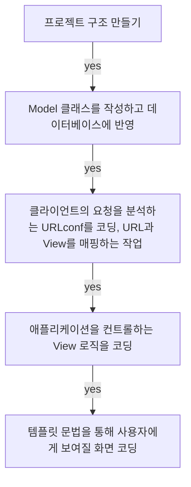

## **Today What I Learend**  

아이디와 비밀번호만 입력할 수 있는 회원가입 기능이지만 예전부터 만들어 보고 싶었던 회원가입 기능을 구현할 수 있게 되었다. 
단순히 따라 만든 것이므로 이것은 아직 나의 것이 아닌 코드이다.
나의 코드로 소화하기 위한 노력을 부단히 하자! 이렇게 조금씩 조금씩 다양한 기능들을 익혀서 거대한 웹 프로젝트를 만들 수 있는 날이 오기를 기대하며! 


---
**Today I Learend**
- 프로젝트 진행 순서, MVT 코딩 순서
- Model coding
- View coding
- Template coding
- 

---


### 프로젝트 진행 순서, MVT 코딩 순서

데이터베이스 테이블 설계는 독립적이므로 Model(모델)을 먼저 코딩하고, 그 다음 서로 연결되어 있는 뷰와 템플릿 중에서는 템플릿을 먼저 코딩하는 방식으로 진행했다!

다만 글은 모델, 뷰, 템플릿 순으로 소개!




### 파일 구조 설정

```
<Root folder>
│
├<community_project>
│ ├── config
│ ├── user
│ │   ├── migrations
│ │   ├── templates
│ │   ├── __init__.py
│ │   ├── admin.py
│ │   ├── apps.py
│ │   ├── models.py
│ │   ├── tests.py
│ │   ├── urls.py
│ │   ├── views.py
│ ├── db.sqlite3
│ ├── manage.py
└venv (가상환경 설정)


```


### Model coding

**모델에서 클래스를 작성할 때는 장고의 모델 클래스를 상속 받아야만 한다 이건 규칙이다.**

username과 password는 문자열을 담을 수 있는 필드로 만들고, 등록일은 registered_dttm라는 데이트 타임의 약자로 만들고, DateTimeField의 인자로는 auto_now_add 값 True를 넣어주는데, 이를 통해 클래스가 저장되는 시점의 시간이 자동으로 저장되므로 현재 시간을 계산해서 따로 넣어줄 필요가 없다.


#### Admin 페이지에서 테이블을 표기하는 두 가지 방법

**첫 번째 방법**


클래스가 문자열로 변환되었을 때, 어떻게 변환할지 결정하는 함수가 있다. 이를 사용해서 모델 클래스를 작성하면서 사용한 변수명으로 관리자 페이지에 보여질 정보를 개선할 수 있다.

```python
def __str__(self):
	return self.username
```

클래스에서 ____str__ 메서드 사용을 통해 username으로 반환하도록 변경할 수 있다.


클래스안에 `class Meta` 클래스를 사용해 테이블 이름을 지정할 수 있다! `Meta` 클래스의 property `db_table`, `verbose_name` 에 값을 할당하여 장고에게 내가 원하는 이름을 전달할 수 있다.
이렇게 `class Meta`를 통해서 테이블명을 지정하는 이유는 기본적으로 생성되는 앱들과 구분하기 위해서이다.

장고 어드민에서는 어플리케이션의 모델을 보여줄 때 기본적으로 복수형을 보여주기 때문에 복수형에 대해서도 따로 설정해주는 것이 좋다.


```python
from django.db import models

# Create your models here.
class User(models.Model):
    username = models.CharField(max_length=32, verbose_name='사용자명')
    password = models.CharField(max_length=64, verbose_name='비밀번호')
    registered_dttm = models.DateTimeField(auto_now_add=True, verbose_name='등록일')

    def __str__(self):
        return self.username

    class Meta:
        db_table = 'app_user'
        verbose_name = '사용자'
        verbose_name_plural = '사용자'
```


#### Admin coding

**두 번째 방법**

Admin 페이지의 리스트에서 더 많은 정보를 원할 때는 어드민 클래스 안에 명시할 수 있다.
list_display 라는 필드에 내가 출력하고 싶은 필드를 선택할 수 있다. 이렇게 명시를 하게 되면 클래스 객체가 리스트업이 되는 게 아니라 모델 클래스 안에 있는 필드들이 리스트 업이 된다.
그래서 사용자명과 비밀번호가 나오게 되고, **보여지는 정보들이 개선된다.**

```python
from django.contrib import admin
from .models import User

# Register your models here.
class UserAdmin(admin.ModelAdmin):
    list_display = ('username', 'password')

admin.site.register(User, UserAdmin)

```


### View coding
url을 연결하면 요청정보가 request 를 통해 들어온다.
레지스터로 들어오는 요청이 두가지가 생긴다.
주소 유알엘로 들어오는 경우, 등록 버튼을 누를 때인 경우

		
```python
from django.http import HttpResponse
from django.shortcuts import render
from django.contrib.auth.hashers import make_password
from .models import User

def register(request):

if request.method == 'GET':
	return render(request, 'register.html')
elif request.method == 'POST':
	username = request.POST.get('username', None)
	password = request.POST.get('password', None)
	re_password = request.POST.get('re-password', None)
	
	err_data = {}	
	 if not (username and password and re_password):
		err_data['info_error'] = '회원정보가 올바르게 입력되지 않았습니다.'
	elif password != re_password:
		err_data['password_error'] = '비밀번호가 다릅니다.'
	else:
		user = User(
			username=username,
			password=make_password(password)
		)
		user.save()
		
	return render(request, 'register.html', err_data)
	
	
```


### Template coding

- 마크다운 문법 오류를 피하기 위해 {{ }} 를 << >> 로 표현

```html
<form method="post" action=".">
  << csrf_token >>
  <div>
    <label for="username">사용자 이름</label>
    <input type="text" class="form-control" id="username" name="username" placeholder="사용자 이름">
  </div>
  
  <div>
    <label for="password">비밀번호</label>
    <input type="password" class="form-control" placeholder="비밀번호" id="password" name="password">
    << password_error >>
  </div>
    
  <div>
    <label for="re-password">비밀번호 확인</label>
    <input type="password" class="form-control" placeholder="비밀번호 확인" id="re-password" name="re-password">
    << password_error >>
  </div>

  <button type="submit" class="btn btn-primary">등록</button>
</form>

```

#### csrf_token

form 태그는 데이터를 서버에 전달하는 역할을 한다. 이 때 우리 사이트에서 데이터를 전송하는 행위는 문제가 없지만 나쁜 목적을 가진 사용자가 자신의 사이트에서 전송하는 행위인 크로스 도메인을 방지하기 위해서 장고는 암호화된 키를 숨겨놓고, 데이터가 전송될 때 이 키 없다면 잘못된 요청이라고 거절한다. 이러한 이유로 `csrf_token` 은 form 태그 안에 작성해야 한다.  

`csrf_token`을 form 태그 안에 작성해 놓으면 django가 스스로 form에 필요한 형태의 해쉬정보, 즉 암호화된 정보를 넣어놓고 검증까지 자동으로 해준다. 이 때문에 다른 곳에서 호출할 경우 발생할 수 있는 문제들을 막아주는 작업을 자동으로 해놓은 장고에서는 csrf 토큰이 없으면 에러가 발생한다.  

그리고 중요한 것 하나로는 사용자 입력을 받는 input 태그의 Attribute에 name이 있어야 한다는 것이다. input 태그의 Attribute name 을 통해서 서버에 데이터가 들어갔을 때 키(key)가 된다.

