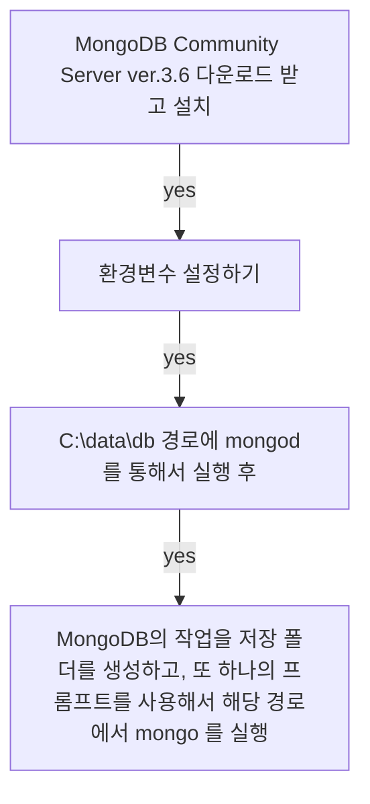

## **Today What I Learend**  

한국사회에서의 개발자 시장에 대해서 이야기 하나
SQL에 대한 리뷰 및 SQL이 NoSQL과 갖는 차이
MongoDB의 설치 과정에 대해서

MongoDB

개발자들이 MongoDB를 사용하는 이유는 
직관적인 데이터 모델 때문일 것이다. MongoDB는 정보를 행(row) 대신에 도큐먼트(document)에 저장한다. 

도큐먼트(document)의 데이터 구조는 한 개 이상의 key-value 쌍으로 되어 있다. 

### MongoDB의 구조 및 스키마 디자인

MongoDB는 하나의 서버에 Database를 여러개 가지고 있을 수 있고, 각 Database 는 여러개의 collection이 있으며, collection 내부에는 document들이 있다.


```
<SERVER>
│
├<Database>
│ ├──<collection>
│ │   ├── document
│ │   ├── document
│ │   ├── document
│ │   └── document
│ │
│ └──<collection>
│     ├── document
│     ├── document
│     └── document
```


---
**Today I Learend**

- 준비단계
- SQL과의 비교
- MongoDB의 구조
- MongoDB 설치
- MongoDB 첫 번째 insert

---


### RDBMS와의 차이점

### RDBMS의 특징

RDBMS 에서 R은 Relation을 말하는 데 여기서 Relation(관계)이 갖는 의미의 대상은 Entity 를 말한다. (Relation과 Relationship)을 혼동하면 안 된다.
> RDBMS 에 대한 이해가 없던 까닭에 나는 여기서의 R이 사용자를 뜻하는 것이 아닌가 생각했었다..

> End User(최종사용자)들도 RDBMS를 많이 활용한다는 건 무슨 뜻일까?

#### 관계형 데이터 모델의 특징
- Nomalization(정규화)
	- 중복제거 
	- 일관성

#### 조인 연산은 비용이 크므로 인덱스르 잘 사용해야 한다.
인덱스를 만들어놓으면 조인 연산에 대한 성능이 좋아진다. 


#### Document Data Model, 문서 데이터 모델의 특징
NoSQL을 사용하게 된다. 
Nomalization을 안 하므로 조인이 없다. 
인덱스가 가지고 있는 경제성 - 문서디비도 인덱스가 필요하다
인덱스는 조인할 때만 필요한 게 아니라
데이터를 찾을 때도 필요하다.
자주 쓰는 거에 인덱스를 걸어두면 금방 찾을 수 있다. 


SQL 		NoSQL
정적 스키마	동적 스키마		| 스키마
E R 모델	  문서 모델		   | 데이터 모델
필수 		  옵셔널, 거의 안씀 | Object Mapper
static		dynamic		   | 데이터베이스 구성


| 특징 | SQL | NoSQL |
|---|:---:|:---:|
| 스키마 | 정적 스키마 | 동적 스키마 |
| 데이터 모델 | Entity Relation 모델 | document모델	 |
|  Object Mapper | 필수 | 옵셔널, 거의 안씀 |
| 데이터베이스 구성 | static | dynamic |


SQL에 비해서 NoSQL 이 가지는 가장 큰 특징은 NoSQL은 **문서가 생성이 되면 저장 공간을 할당한다.** 즉, insert 전까지 콜렉션이 생성되지 않는다!!


#### Literal은 코드 상에서 데이터를 표기하는 방법
리터럴은 어떤 데이터를 표기하는 법
{} - 객체를 표현할 때 사용하는 표기법, 객체 리터럴
[] - 배열, 리스트, Document 를 표현하느 표기법, 배열 리터럴 


#### collection
MongoDB도 create collection 이라는 명령으로 document를 담는 그릇을 미리 만들어 놓을 수도 있지만!! 대부분은 데이터를 넣을 때 생성이 되게 만든다..

#### 모든 문서는!!
모든 문서는!, 중첩된 문서는 제외!!
서브 다큐먼트는 문서가 없었다. 
서브 문서에는 아이디가 없었다.


count()는 collection이 가지고 있는
문서의 수를 반환해주는 api 함수이다. 

`pk`의 역할은 `_id`가 대신한다.
`_id` 값을 따로 값을 설정하지 않으면 자동으로 생성된다.


#### 데이터가 쓰이지 않는 곳이 없다. 

가령, 게임도 결국 운영되기 위해서는 데이터가 필요하다.
그리고 우리가 일하게 되면 받는 급여명세서를 구성하고 있는 항목들도 성명, 사번, 근퇴, 휴가일수, 기본급 등으로 이루어져 있다.

**이처럼 모든 시스템에는 데이터베이스가 존재한다. 모습은 다르나 데이터베이스의 역할을 이해해야 데이터베이스를 만들 수 있다.** 


관계형 데이터 베이스는 **정규화**라는 과정을 거친다. 한 블로그에서 정규화를 수행하기 위해서는 속성들간의 관련성을 파악해야 하는데, 이 속성들간의 관련성을 함수적 종속성(Functional Dependency)이라고 하고, 일반적으로 하나의 릴레이션에는 하나의 함수적 종속성만이 존재하도록 정규화를 한다고 한다. - [정규화에 대해 이해를 얻을 글](https://yaboong.github.io/database/2018/03/09/database-anomaly-and-functional-dependency/)


RDBMS는 한 행(row)이라는 레코드 정보를 근간으로 해서 데이터 구조를 만들고, 이 한 행(row)에는 여러개의 컬럼, 필드, 각종 제약 정보를 정의한 것, 데이터 타입과 길이, 동일한 제약 조건과 같은 여러개의 컬럼으로 구성되어 있는 로우를 가지고 PK(프라이머리키)를 만든다.

PK로 적당한 Column은 Not Null, Unique 라는 조건을 가지고 있어야 한다.
Pk에 대한 이해를 돕기 위해서 아래 목록 중 무엇이 가장 PK에 적합할까?
- 주민등록번호
- 사번
- 이메일
- 전화번호


이메일이나 전화번호는 **변경 가능성**으로 인해 프라이머리키로 설정하는 데 어려움이 있고, 주민등록번호는 현업에서는 더 이상 사용하지 않는다.
실제 20년 전에는 PK를 주민등록번호로 사용한 경우도 있었지만 이제는 거의 쓰이지 않는다고 한다. 왜냐하면 주민등록 번호는 완벽하지 않기 때문에


#### PK 란 무엇인가?

PK는 행을 구분한다.

RDBMS에서 종속성을 익히게 되면
Y -> X 처럼 기술할 수 있게 된다. 

Y키 X값
함수적 종속성(functional Dependency) 
관계형 데이터베이스에서는 수학의 관계 대수에서 만들어졌다.

함수 종속성의 문제가 발생하지 않아야 한다. 

Y에 의해서 X가 결정된다.

주문 -< 주문 내역
1:N
관계 내역이 만들어진다.
중복을 제거하는 분해가 연속적으로 일어난다. 

2nd NF
3rd NF
최소한 써드 노멀폼까지 가도록...!
보이스코드 노멀폼전까지 보통 분해를 한다.

처음에 한 덩어리였던 것을 써드 노멀폼까지 분해하는 과정을 거친다...!!
보이스 코드나 써드 노멀폼 까지 분해를 한다. 
분해를 해서 가면 데이터의 중복이 없어진다.

> 데이터의 품질을 저해하는 가장 큰 원인이 데이터의 중복이다. 중복은 일관성의 문제를 일으킨다. 

> 프라이머리키는 데이터를 연결하는데 사용된다. 즉, 조인하기 위해서는 PK가 필요하다. 이러한 이유에서 관계형 데이터베이스에 조인이 없다는 건 모델을 잘못만들었다는 걸 뜻한다. 


#### 컬럼 간의 같은 값을 연결하는 게 조인이다. 
가령, 12억명을 출생지별로 묶는 조인을 해야 할 때 큰 비용이  발생하는 건 자명한 사실이다. 

이렇게 같은 사람끼리 묶는 조인을 해야 한다면 
FK를 만들 때는 `CREATE INDEX` 를 해야 한다

데이터를 다 뒤져보는 행위를 Full Scan이라고 하는 데, Full Scan 을 통해서 원하는 값을 찾는 건 데이터가 커질수록 비용이 많이 든다.

데이터가 클수록 인덱스가 있는 구조와 없는 구조는 데이터를 찾늗 데 있어서 비용이 하늘과 땅 차이로 벌어진다.


인덱스라는 매커니즘을 이해하지 못하고 코드를 작성하지 못하면
쿼리문은 쓰레기가 된다. 즉, 어떤 쿼리를 입력했을 때 6초 뒤에나 가져오는 경우라면...


#### index!!
비교우위에 서려면 인덱스를 활용할 수 있는 능력이 중요하다
질문을 몇개해보면
DB를 다루어봤는지 아닌지 알 수 있다.

인덱스에 관한 질문에 대해서 준비를 해야 한다.

#### JOIN
EQ 조인
PK와 FK를 활용해서 연결하는 게 조인이다.

Foreign Key에 인덱스가 안 걸려 있다면

> 관게형 데이터베이스는 조인을 안하는 경우가 없다. 조인을 하지 않은 경우가 있다면 그것은 모델링을 잘못한 것이다. RDBMS에서 데이터를 보기 위해서는 테이블간의 연결을 다 보아야 한다.


#### 주문서 데이터를 분리하는 게 노말라이제이션

하나의 주문서가 주어질 경우, 여기서 발생할 수 있는 중복의 문제를 해결하는 게 노말라이제이션이다. 
하나의 주문서에 여러가지 상품이 담긴다면..! 데이터의 중복을 막기 위해서 테이블을 분리해서 중복을 제거해야 한다. 


#### 트랜잭션..

> 트랜잭션에 대한 이해를 적기


#### ROllBACK이라는 용어를 알았다면 트랜잭션을 이해했다는 것
ROllBACK 은 트랜잭션을 뒤로 돌리는 것이다. 즉, DML을 사용하기 이전의 행위로 돌리는 것이 ROLLBACK이다. ROllBACK은 주로 데이터 일관성의 문제가 발생했을 때 사용한다. 


#### 장바구니에 담은 상품조차도 분석을 위해서 DB에 넣는 요즘

현업에서는 Auto Commit(오토 커밋)을 쓰지 않는다. 오토커밋은 DML을 입력하면 바로 데이터가 들어가는 것을 일컫는다.


복수의 값을 갖는 경우에는 노말라이제이션을 했는데
문서의 경우에는 그냥 집어넣을 수 있다. 


### MongoDB와 비교했을 때 가지는 차이
관계형 데이터베이스는 N:N이 안되지만, NoSQL은 N:N이 된다. 관계형 데이터베이스에서 N:N 을 사용하기 위해서는 테이블을 연결하는 테이블인, 관계 엔티티(Associative Entity) 가운데 있어야 한다.

> 관계형 데이터베이스는 N:N을 위해선 가운데 하나를 거쳐야 한다. 
> 관계형 데이터베이스를 쓰는 경우에는 잘 설계한다면 조인을 쓰지 않을 수도 있다. 이 지점으로 인해 웹 개발을 빠르게 할 수 있는 이점이 있는 게 아닐까? 얼른 웹 애플리케이션을 만들어보고 싶다.!


### MongoDB는 사전 정의가 없다.

document의 묶음을 collection 이라고 한다. MongoDB으 document는 스키마가 없다보니 제약이 없다. 가령, 서로 다른 구조의 키를 가지고 있어도 문제가 없다.

이러한 이점으로 인해 개발할 때 더 편하다. 이 때문에 상당히 빠르게 개발할 수 있다는 장점이 있다. 스키마가 없음으로 인해 너무 자유롭다.다만 통제가 잘 안된다.


#### 인덱스를 쓰는 이유
인덱스는 데이터가 많을 때 경제성이 뛰어나다.
인덱스의 구조는 B-트리이다. 


### MongoDB의 특성

#### Scale Up VS Scale Out 

Scale Out을 했을 때는 Sharding 샤딩이 필요하다. Sharding(샤딩)은 분산데이터베이스를 구현할 때 사용하는 방법이며, Sharding을 통해서 옆으로 계속 확장할 수 있다.

**Shard1, Shard2, Shard3**


몽고디비는 Scale Out하기에 좋은 구조를 가지고 있다. 

데이터의 구조가 내포형이라면,(카탈로그 형태라면) 문서형 데이터베이스를 쓰는 게 좋다.이 지점에서는 관계형 DB보다 훨씬 큰 이점을 지니고 있다. 


### MongoDB 설치


환경변수 설정하기 
설정 후에는...! 프롬프트를 재시작해야 한다.
mongod.exe 실행 후 
mongo.exe  실행하기 그러면 > 가 뜸


최초 다큐멘트가 콜렉션에 저장이 되면...!
최초의 다큐멘트가 만들어지면 그 때
만들어진다.! 

기본적으로 필요한 시스템 데이터베이스이다. 





#### 맴캐시디..!

맴캐시디가 Reddis로 대체되는 경향이 크다. 
아주 간단한 키와 벨류로 저장하는 데이터베이스다

**맴캐시디**
구조가 키와 값 구조로만 되어있다.
키만 알면 값을 꺼낼 수 있는 구조이다. 

맴: 메모리
캐쉬: 읽기 속도를 높이기 위해서 사용하는 매커니즘 
디: 저장장치


메모리 데이터베이스로 사용하는 것을 말한다. 
메모리에 올리면 빠르니까...!

리악은 팔로잉, 팔로워할 떄 주로 쓰인다.
리악은 그래프 데이터베이스이다.


 Column Based 스토리지 
 

관계형 데이터베이스는 행기반인데 반해
Column Based 스토리지는 컬럼 기반으로 저장한다.

대용량 데이터 처리를 할 때 카산드라를 주로 사용한다.
컬럼별로 정렬되어 있을 때...!, 

주로 수직적인 확장을 하는데 유리하다. 
마이에스큐엘은 

다큐먼트 구조느 내포구조
문서를 표현하는 구조는 JSON
그리고 JSON에 익숙해지면서
자바스크립트의 객체 접근법을 가지고 데이터에 접근해야 한다. 

내가 필요한 데이터, 즉 내포구조를 가지고 있으므로 
조인을 안 해도 된다.

조인을 안 하고도 원하는 결과를 얻을 수  있다.

100% 조인을 안하는 결과를 얻을 수 있는가?
그것은 아니다!!

참조에 대한 매커니즘을 문서참조라고 해서 들어갈 수 있다. 
정규화되어 있는 관계형 모델보다는
조인 연산이 줄어드는 부분은 분명하다.


NoSQL의 경우 트랜잭션을 지원하지 않는 경우가 있는데
몽고디비는 지원을 한다
만약 디비에서 지원을 안 해준다면
애플리케이션 차원에서 그 기능을 만들어야 한다. 


데이터 베이스는 키와 값으로 구성이 된다!!
그래서...! 


predicate

