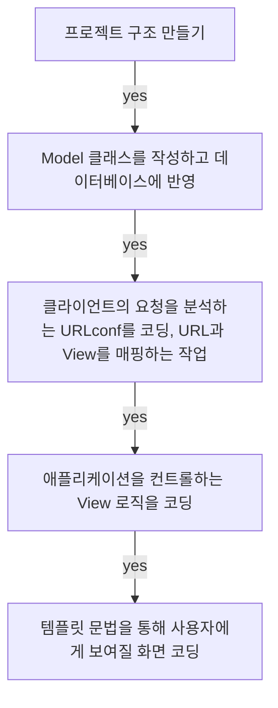

## **Today What I Learend**  

회원가입 기능과 더불어서 늘 만들어보고 싶었던 로그인 기능을 만들어 보았다. 
단순히 따라 만든 것이므로 이것은 아직 나의 것이 아닌 코드이다.
나의 코드로 소화하기 위한 노력을 부단히 하자! 이렇게 조금씩 조금씩 다양한 기능들을 익혀서 거대한 웹 프로젝트를 만들 수 있는 날이 오기를 기대하며! 


---
**Today I Learend**
- 프로젝트 진행 순서, MVT 코딩 순서
- Model coding
- View coding
- Template coding

---


### 프로젝트 진행 순서, MVT 코딩 순서

데이터베이스 테이블 설계는 독립적이므로 Model(모델)을 먼저 코딩하고, 그 다음 서로 연결되어 있는 뷰와 템플릿 중에서는 템플릿을 먼저 코딩하는 방식으로 진행했다!





### 파일 구조 설정

```
<Root folder>
│
├<community_project>
│ ├── config
│ ├── user
│ │   ├── migrations
│ │   ├── templates
│ │   ├── __init__.py
│ │   ├── admin.py
│ │   ├── apps.py
│ │   ├── models.py
│ │   ├── tests.py
│ │   ├── urls.py
│ │   ├── views.py
│ ├── db.sqlite3
│ ├── manage.py
└venv (가상환경 설정)


```


