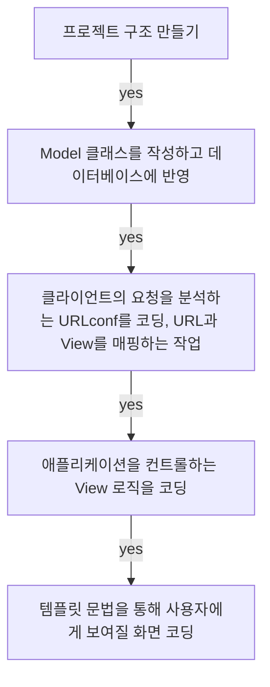

## **Today What I Learend**  

회원가입 기능과 더불어서 늘 만들어보고 싶었던 로그인 기능을 만들어 보았다. 
단순히 따라 만든 것이므로 이것은 아직 나의 것이 아닌 코드이다.
나의 코드로 소화하기 위한 노력을 부단히 하자! 이렇게 조금씩 조금씩 다양한 기능들을 익혀서 거대한 웹 프로젝트를 만들 수 있는 날이 오기를 기대하며! 


---
**Today I Learend**
- 프로젝트 진행 순서, MVT 코딩 순서
- Model coding
- View coding
- Template coding

---


### 프로젝트 진행 순서, MVT 코딩 순서

데이터베이스 테이블 설계는 독립적이므로 Model(모델)을 먼저 코딩하고, 그 다음 서로 연결되어 있는 뷰와 템플릿 중에서는 템플릿을 먼저 코딩하는 방식으로 진행했다!





### 파일 구조 설정

```
<Root folder>
│
├<community_project>
│ ├── config
│ ├── user
│ │   ├── migrations
│ │   ├── templates
│ │   ├── __init__.py
│ │   ├── admin.py
│ │   ├── apps.py
│ │   ├── models.py
│ │   ├── tests.py
│ │   ├── urls.py
│ │   ├── views.py
│ ├── db.sqlite3
│ ├── manage.py
└venv (가상환경 설정)


```


### Model coding

모델은 따로 코딩하는 것이 없다. 


#### 페이지를 분기하는 코드를 만든다. 
단순 로그인화면과 로그인을 통해 사용자 정보를 저장한 화면을 나누는 작업을 처리한다. 

로그인 기능이 요청되었다면 
Input 을 통해 넘어온 값을 변수에 저장하고

### View coding

#### Login view

```python
def login(request):
    if request.method == 'GET':
        return render(request, 'login.html')
    elif request.method == 'POST':
        username = request.POST.get('username', None)
        password = request.POST.get('password', None)
		
	return render(request, 'login.html', res_data)
	
```

데이터가 모두 입력되었는지 검증하는 절차를 가진다. 

데이터가 모두 입력되었을 경우 DB의 값과 비교하기 위해서
데이터를 저장한 모델로부터 가지고 와야 한다.  
이 아이디를 사용한 유저 모델을 가지고 와서 사용자가 입력한 비밀번호와 username을 사용한 fcuser 모델을 가지고 온다.  

입력받은 비밀번호와 Model 안에 있는 비밀번호가 일치하는지 확인해야 한다.

확인을 위해서 fcuser 변수에 username에 대한 정보를 가지고 온다.

**2.** check_password 메서드의 첫 번째 인자에는 현재 입력된 비밀번호, 두 번째 인자에는 모델로부터 가져온 비밀번호를 넣으면 이 둘이 같다면 로그인 처리를 진행하는 코드를 작성하고, 틀렸다면 안내문구를 처리하는 코드를 작성한다. 

여기서부터 Session에 대해서 다루게 되는 데, 세션에 대한 처리를 진행 후, 홈으로 가게 하기 위해서 리다이렉트를 거는 작업을 한다. 


세션은 각 키마다 값을 가지고 있는 딕셔너리와 비슷한 형태이먀, 유저라는 키에 아이디값을 저장했는데, 이렇게 넣은 것만으로 저장과 세션에 대한 처리가 끝난다.


```python  
res_data = {}
if not (username and password):
	res_data['info_error'] = '아이디와 비밀번호가 입력되지 않았습니다.'
else:
	user = User.objects.get(username=username) 
	# 앞은 필드명, 뒤는 입력을 저장한 변수 username
	
	# 2.번 설명
	# 입력받은 비밀번호, 모델로부터 가져온 값
	if check_password(password, fcuser.password):
		res_data['password_valid'] = '아이디와 비밀번호가 올바릅니다.'
		# 비밀번호가 일치, 로그인 처리를 진행!
		# 1. 세션에다가 저장하기
		request.session['user'] = fcuser.id

		# 2. Root로 redirect 
		return redirect('/')
	else:
	# 비밀번호 불일치,
	res_data['password_error'] = '비밀번호가 틀렸습니다.'

return render(request, 'login.html', res_data)

```

#### Home view

Login 진행 후 home으로 리다이렉트 되었을 때, user가 session내에 있다면 사용자 정보를 user_id 라는 변수에 할당한다.

user_id가 존재한다면 세션의 유저키(`request.session['user']`)에 넣어놓은 아이디를 가져온다.
user_id를 pk로 해서 모델을 가져오고!!

가져온 정보를 화면에 보여주기 위해 HttpResponse 의 인자에 넣는다. 

user_id 값이 있다면 로그인한 클라이언트, 없다면 로그인하지 않은 클라이언트이다. 

```python
def home(request):
    user_id = request.session.get('user')
    if user_id:
        user = User.objects.get(pk=user_id)
        return HttpResponse(user.username)

    return HttpResponse('Home')

```


### Template coding

템플릿 코드는 회원가입과 다를바가 없다.

`submit` 버튼의 벨류값과 태그내 값들만 바꾸어주고
아이디와 비밀번호만 입력할 수 있는 input tag만 남겨주면 된다. 

\{\{ \}\} 와 \{\% \%\} 을 <>로 표현

```python
<form method="post" action=".">
  < csrf_token >
  <div class="form-group">
	<label for="username">사용자 이름</label>
	<input type="text" class="form-control" id="username" name="username" placeholder="사용자 이름">
  </div>
  <div class="form-group">
	<label for="password">비밀번호</label>
	<input type="password" class="form-control" placeholder="비밀번호" id="password" name="password">
	 < password_error >
  </div>


  <button type="submit" class="btn btn-primary">로그인</button>
</form>


```


### 세션에 대한 정리

> 세션에 대한 이해를 예시를 통해서 설명하고자 함

네이버 주소를 요청하면 네이버에서 웹사이트에 대한 응답을 주면서 헤더(header)라는 곳에 쿠키(cookie)라는 정보를 넣어서 준다.
클라이언트는 쿠키 정보를 내 쿠키 저장소에 저장을 한다.


아래는 쿠키에 대한 설명 [(HTTP 쿠키 - HTTP | MDN)](https://developer.mozilla.org/ko/docs/Web/HTTP/Cookies)
> HTTP 쿠키(웹 쿠키, 브라우저 쿠키)는 서버가 사용자의 웹 브라우저에 전송하는 작은 데이터 조각입니다. 브라우저는 그 데이터 조각들을 저장해 놓았다가, 동일한 서버에 재 요청 시 저장된 데이터를 함께 전송합니다. 쿠키는 두 요청이 동일한 브라우저에서 들어왔는지 아닌지를 판단할 때 주로 사용합니다. 이를 이용하면 사용자의 로그인 상태를 유지할 수 있습니다. 상태가 없는(stateless) HTTP 프로토콜에서 상태 정보를 기억시켜주기 때문입니다.

쿠키는 주로 세 가지 목적을 위해 사용되는데

1. 세션 관리(Session management)
	- 서버에 저장해야 할 로그인, 장바구니, 게임 스코어 등의 정보 관리
1. 개인화(Personalization)
	- 사용자 선호, 테마 등의 세팅
1. 트래킹(Tracking)
	- 사용자 행동을 기록하고 분석하는 용도


Client는의 요청에 의해 서버는 Client가 쿠키로 사용할 키를 생성해서 문자열을 만들고 나서 데이터베이스에 등록을 한 후, Client에게 알려준다.
Client는 할당받은 문자열을 자기 저장소에 저장을 한다(해당 사이트에서만 사용할 키)
이 때 각 웹사이트 별로 나눠서 저장을 한다.

내 쿠키 저장소에 저장을 한다. 쿠키로 사용할 키를 만든다.


그 다음 요청부터는 모든 요청에 쿠키에 저장한 키를 같이 보낸다. 이때 디비는 아까 들어왔던 애구나 하고 금방 알 수 있게 된다. 웹사이트는 원하는 정보를 디비에서 꺼내서 쓰게 된다.


이를 통해 서버에서는 Client를 구별해서 인지할 수 있고, 서버는 Client가 가지고 있는 키를 통해서 Client를 구분할 수 있다. Client에서 로그인한 사용자 정보를 가지고 있어야 한다. 로그인을 한 후에는 내가 로그인한 사용자라는 것을 서버가 인지해야 한다. 원하는 정보를 디비에서 꺼내서 쓸 수 있게 해준다.

Client에서 유지해야 하는 데이터를 유지할 수 있도록 돕는다. 
쿠키에 사용되는 키를 가지고 Client를 구분할 수 있다.


```
가령 네이버 주소를 요청하면
네이버 웹사이트를 응답을 주면서
헤더라는 위치에다가 쿠키라는 정보를 넣어서 준다.
클라이언트는 쿠키 정보를 내 쿠키 저장소에 저장을 한다.

클라이언트의 요청에 서버는 클라가 쿠키로 사용할 키를 생성해서
문자열을 만들고 나서 데이터베이스에 등록을 하고나서
클라이언트에게 알려준다.
클라는 할당받은 문자열을 자기 저장소에 저장을 한다(해당 사이트에서만 사용할 키)
이 때 각 웹사이트 별로 나눠서 저장을 한다.

내 쿠키 저장소에 저장을 한다.
쿠키로 사용할 키를 만든다.


그 다음 요청부터는 모든 요청에
쿠키에 저장한 키를 같이 보낸다.
이떄 디비는 아까 들어왔던 애구나ㅣ 하고 금방 알 수 있게 된다.
웹사이트는 원하는 정보를 디비에서 꺼내서 쓰게 된다.

이를 통해 서버에서는 클라를 구별해서 인지할 수 있고
서버는 클라이언트가 가지고 있는 키를 통해서 클라이언트를 구분할 수 있다.
클라이언트에서는 로그인한 사용자 정보를 가지고 있어야 한다.
로그인을 한 후에는 내가 로그인한 사용자라는 것을 서버가 인지해야 한다.
원하는 정보를 디비에서 꺼내서 쓸 수 있게 해준다.

클라이언트에서 유지해야 하는 데이터를 유지할 수 있도록 돕는다.
쿠키에 사용되는 키를 가지고 클라이언트를 구분할 수 있다.

```


### 로그인시 일어나는 과정

1. 내부적으로 일어나는 과정  

변수에다가 값을 넣어놓으면 끝, 그 변수가 있으면 로그인이 끝
쿠키와

세션은 어떻게 그 서버에 데이터를 유지하고 있는지 살펴보기
세션은 처음에 서버에 접속했을 떄 세션아이디를 받아서
쿠키에 저장을 하고 있고, 그리고 모든 요청에 아이디가 같이 넘어가고 이게 모든 브라우저의 식별자가 된다.
쿠키를 받아서 모든 요청에 넘어간다.

시크릿창을 열면 서버 입장에서는 다른 브라우저가 되므로 sessionid 또한 다르게 발급된다. 서버입장에서 다른 애다..!
request.session의 ['user']라는 키에 값이 브라우저 별로 전용성을 갖게 발급된다. 각 세션 아이디 별로 세션 공간이 있다고 보면 된다.


